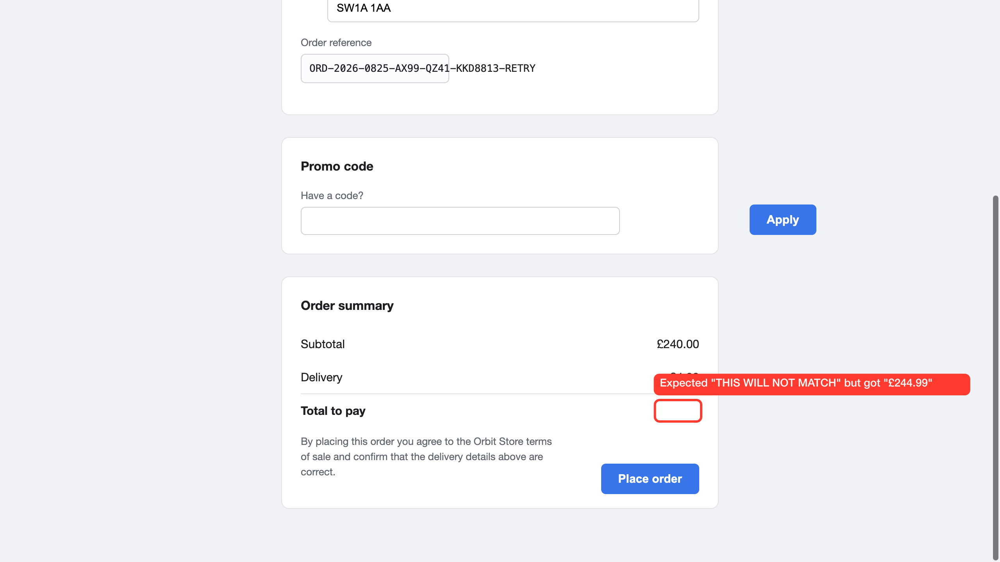
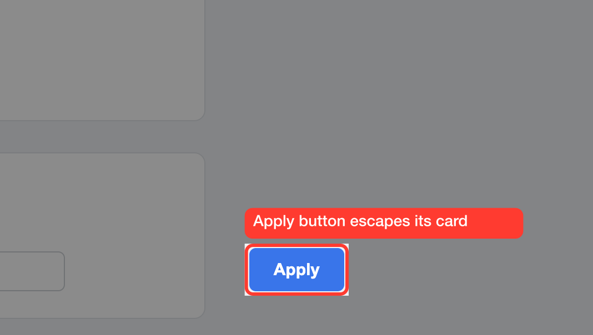

# cypress-annotate

When a Cypress test fails in CI, the screenshot shows you the whole page. This
draws a box on the element that actually failed, labelled with the assertion's
own expected and actual values.



That label came from `err.expected` and `err.actual`, with no model call and no
network. `sharp` is the only thing that installs with the package.

It overwrites the screenshot Cypress just took, so the annotated version is what
lands in your reports, your CI artifacts and Cypress Cloud. No second file to
collect, no reporter to configure.

## Install

```bash
npm install --save-dev cypress-annotate
```

Needs Node 20.19+ or 22.12+, the versions that can `require()` an ES module,
which is what Cypress's default preprocessor does with the import below.

```ts
// cypress.config.ts
import { registerAnnotateTasks } from 'cypress-annotate/cypress/task';

export default defineConfig({
  // Required: Cypress's automatic screenshot would otherwise race the hook's,
  // and it becomes ambiguous which one the DOM measurement matches.
  screenshotOnRunFailure: false,
  e2e: {
    setupNodeEvents(on, config) {
      registerAnnotateTasks(on, config);
    },
  },
});
```

```ts
// cypress/support/e2e.ts
import 'cypress-annotate/cypress/commands';
import { registerFailureCapture } from 'cypress-annotate/cypress/failure-hook';

registerFailureCapture();
```

That's the whole setup. Measuring happens in the browser and compositing in
Node, which is what the task is for.

Every failed test now annotates itself and appends a record to
`out/cypress/failures.json` with the recovered selector, `expected`, `actual`,
the image paths and the drawn rect. Failures with no recoverable selector, like
an existence check, are still captured with a live inventory of candidate
elements that [annotate-agent](https://github.com/bidemiajala/annotate-agent)
can hand to Claude afterwards.

## In CI

```yaml
- run: npx cypress run
- uses: actions/upload-artifact@v4
  if: always()
  with:
    name: annotated-screenshots
    path: out/cypress
```

**Without Cypress Cloud**, the annotated PNG is what `upload-artifact` collects,
because the annotation is written over the screenshot before the run ends.

**With Cypress Cloud**, it is the same file and the same code path: a
`cy.screenshot()` overwritten in place is picked up by `cypress run --record`
and uploaded as a normal `Screenshot` artifact. Confirmed against a real
recorded run. No Cloud API is involved and there is nothing to configure.

A run also writes `out/cypress/annotations.json`, one record per annotated
screenshot, and on GitHub Actions appends a table of it to the job summary.

## Make it yours

Set your defaults once, in `cypress.config.ts`:

```ts
export default defineConfig({
  env: {
    annotate: {
      style: { color: '#7C3AED', strokeWidth: 4, labelBackground: '#1F1F23' },
      keepRaw: true,
    },
  },
});
```

Cypress serialises `env` into the browser, so that one block reaches
`cy.annotate()` and the failure hook alike, and
`CYPRESS_annotate='{"style":{"color":"#0A9E4A"}}'` overrides it for a single CI
job. A misspelled key warns rather than being silently ignored. Layers merge
lowest first: built-in defaults, this block, the options passed to one call,
then a per-target style.

**`style`:** `color` `#FF3B30`, `strokeWidth` `3`, `padding` `4`, `radius` `6`,
`dimOutside` `0`, `labelFontSize` `14`, `labelColor` `#FFFFFF`,
`labelBackground` (defaults to `color`), `labelFontFamily`, `labelFontWeight`
`600`. Sizes are CSS px, scaled to the capture.

**Everything else:** `shape` `box`, `crop` `false`, `cropPadding` `40`,
`keepRaw` `false`, `scrollOffset` `120`, `manifestPath`, `reportPath`.

## Annotating on purpose

When you already know what's wrong, box it yourself. Several targets at once,
each with its own label, and `{ frame, selector }` to reach inside an iframe:

```ts
cy.annotate(['#promo-apply', { frame: 'iframe#checkout', selector: '.pay' }], {
  label: ['Escapes its card', 'Overflows the frame'],
});
```

The frame offset used is its content origin, so a frame with its own border and
padding lands correctly, and one scrolled internally needs no correction.
Cross-origin frames fail loudly rather than drawing a box in the wrong place.

Crop tight for a ticket, and dim separately, since a crop on its own keeps the
surroundings at full brightness:

```ts
cy.annotate('#promo-apply', {
  label: 'Apply button escapes its card',
  crop: true,
  cropPadding: 220,
  style: { dimOutside: 0.45 },
});
```



The command yields where the box landed, so you can assert on it: `drawnRects`,
`warnings`, `outPath`, `rawPath`, `width`, `height` and `scale`. Per call you
can also set `name`, a one-off `style`, `scrollIntoView`, and `fullPage`, which
Cypress builds by scrolling and stitching, so fixed elements get painted several
times into one image. Viewport capture is the default for that reason.

## Known limits

- Label widths are estimated from an average glyph ratio, because librsvg gives
  no text measurement API. The ratio suits the default sans stack, so an
  unusually wide or narrow `labelFontFamily` wraps a little early or late.
- CI covers Electron, Chrome and Firefox. No suite covers fixed elements under a
  full-page capture, which the plugin sidesteps by capturing the viewport.
- The failure hook reads `cy.state('current')`, undocumented Cypress internals.
  It is guarded, so an upgrade that renames it degrades to "no selector
  recovered" rather than breaking your `afterEach`.

[DOCS/internals.md](DOCS/internals.md) has the coordinate rules, the traps worth
knowing before you hit them, and how alignment is verified against painted
pixels. `skills/cypress-annotate/SKILL.md` is the same material for a coding
agent. [CHANGELOG.md](CHANGELOG.md) covers what changed in 1.0.0 and how to
migrate. MIT.
