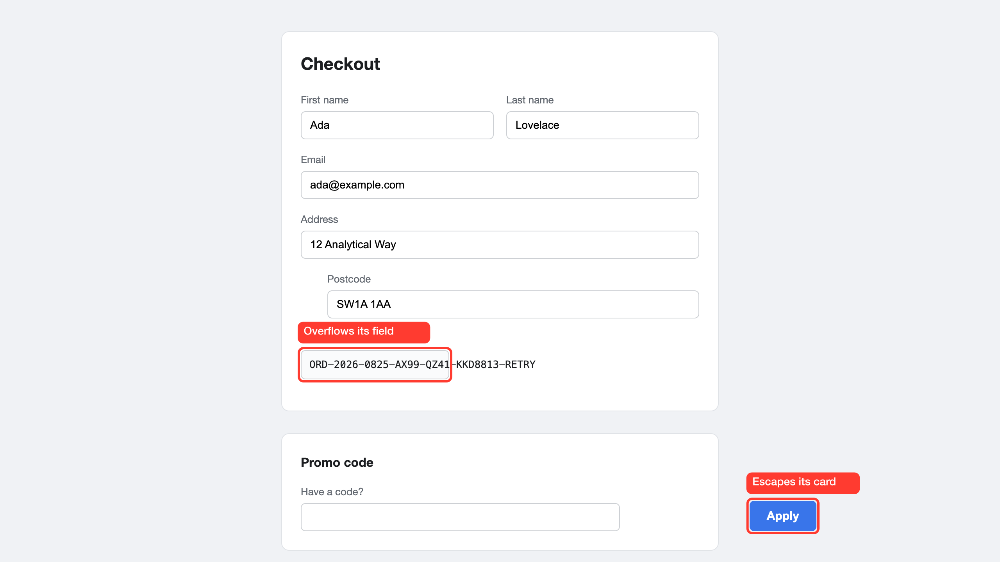

# cypress-annotate

When a Cypress test fails in CI, the screenshot shows you the whole page. This
draws a box on the element that actually failed, labelled with the assertion's
own expected and actual values.


That label came from `err.expected` and `err.actual`. No model was called, no
browser was downloaded, and nothing was uploaded anywhere. `sharp` is the only
thing that installs with the package.

It overwrites the screenshot Cypress just took, so the annotated version is what
lands in `cypress/screenshots/`, in your reports, in your CI artifacts, and in
Cypress Cloud. There is no second file to collect and no reporter to configure.

## Install

```bash
npm install --save-dev cypress-annotate
```

Needs Node 20.19+ or 22.12+. The package is ESM, and those are the versions that
can `require()` an ES module, which is what Cypress's default webpack and Babel
preprocessor ends up doing with the import below.

```ts
// cypress.config.ts
import { defineConfig } from 'cypress';
import { registerAnnotateTasks } from 'cypress-annotate/cypress/task';

export default defineConfig({
  // Required by the failure hook. See "Every failed test, annotated" below.
  screenshotOnRunFailure: false,
  e2e: {
    setupNodeEvents(on, config) {
      registerAnnotateTasks(on, config);
    },
  },
});
```

Measuring happens in the browser and compositing happens in Node, which is what
that task is for.

```ts
// cypress/support/e2e.ts
import 'cypress-annotate/cypress/commands';
import { registerFailureCapture } from 'cypress-annotate/cypress/failure-hook';

registerFailureCapture();
```

That's the whole setup. Everything below is optional.

## Every failed test, annotated

With the hook registered, you write no annotation code at all. On each failure it
recovers the selector the failing command was targeting, using
`cy.state('current')`'s own args where they're available and falling back to
chai-jquery's `<tag#id>` rendering in the error message. It measures that element
live while the page is still in its failed state, scrolls it into view if needed,
and draws the box.

Every failure also appends a record to `out/cypress/failures.json` carrying the
spec and test name, the recovered selector and where it came from, `expected` and
`actual`, the image paths, the drawn rect, page metrics and any warnings.

`screenshotOnRunFailure: false` is required. Otherwise Cypress's automatic
screenshot and this hook's screenshot race each other, and it becomes ambiguous
which one the DOM measurement matches.

**When no selector can be recovered**, as with an existence check, a
`cy.contains()` chain, or a generic page-state assertion, there is nothing to box
deterministically. Those failures still get captured: a plain screenshot plus a
live inventory of candidate elements, because a screenshot on its own carries no
DOM information and the browser session will be gone by the time anyone looks at
it. [annotate-agent](https://github.com/bidemiajala/annotate-agent) reads that
report and asks Claude where each one shows up, as a step you opt into.

## In CI

```yaml
- run: npx cypress run
- uses: actions/upload-artifact@v4
  if: always()
  with:
    name: annotated-screenshots
    path: |
      cypress/screenshots
      out/cypress
```

**Without Cypress Cloud**, the annotated PNG is what `upload-artifact` collects,
because the annotation is written over the screenshot before the run ends.

**With Cypress Cloud**, it is the same file and the same code path. A
`cy.screenshot()` taken from an `afterEach` hook and overwritten in place is
picked up by `cypress run --record` and uploaded as a normal `Screenshot`
artifact, under the same category and through the same pipeline as any other
Cypress screenshot. Confirmed against a real recorded run: the uploaded image
showed the box. There is no Cloud API involved, and nothing to configure.

That confirmation replaced an earlier design that looked safer: overwrite
Cypress's own *automatic* on-failure screenshot, on the theory that mutating the
file Cypress already tracks removes all doubt. It doesn't work. That automatic
screenshot includes the full Runner UI, the command log sidebar and the browser
toolbar, with the app rendered at some auto-computed zoom that is never a 1:1
capture, so there is no reliable coordinate maths to draw a box on it at all.

Two things come out of a run besides the images:

- `out/cypress/annotations.json`, one record per annotated screenshot, so a
  downstream step can list what was produced without walking the folder guessing
  which files are yours. It is cleared at the start of each run.
- On GitHub Actions, a table of that manifest appended to the job summary, so
  what a run produced is readable on the job page without downloading anything.

Nothing in any of this needs an API key available to the test job.

## Make it yours

Set your colours once, in `cypress.config.ts`:

```ts
export default defineConfig({
  env: {
    annotate: {
      style: {
        color: '#7C3AED',
        strokeWidth: 4,
        labelBackground: '#1F1F23',
        labelFontFamily: "'Inter', system-ui, sans-serif",
      },
      keepRaw: true,
    },
  },
});
```

Cypress serialises `env` into the browser, so that one block reaches
`cy.annotate()` and the failure hook alike, and
`CYPRESS_annotate='{"style":{"color":"#0A9E4A"}}'` overrides it for a single CI
job. A misspelled key warns rather than being silently ignored.

Layers merge lowest first: the built-in defaults, your config block, the options
passed to a single call, then a per-target style.

| Style option | Default | What it does |
| --- | --- | --- |
| `color` | `#FF3B30` | Outline colour, and the label pill unless you set one. |
| `strokeWidth` | `3` | Outline width in CSS px, scaled to the capture. |
| `padding` | `4` | Grow the box outwards so it doesn't sit on the element's edge. |
| `radius` | `6` | Corner radius in CSS px. |
| `dimOutside` | `0` | Darken everything outside the boxes, 0 to 1. |
| `labelFontSize` | `14` | Label size in CSS px. |
| `labelColor` | `#FFFFFF` | Label text colour. |
| `labelBackground` | `color` | Label pill colour, when it should differ from the outline. |
| `labelFontFamily` | system sans stack | Any CSS font-family. |
| `labelFontWeight` | `600` | Any CSS font-weight. |

| Run option | Default | What it does |
| --- | --- | --- |
| `shape` | `box` | `box`, `circle` or `arrow`. |
| `crop` | `false` | Crop to the element, keeping `cropPadding` of context. |
| `cropPadding` | `40` | CSS px of context kept around the crop. |
| `keepRaw` | `false` | Write `<name>.raw.png` beside each shot, for diffing. |
| `scrollOffset` | `120` | CSS px left above an element that had to be scrolled to. |
| `manifestPath` | `out/cypress/annotations.json` | Where the run manifest goes. |
| `reportPath` | `out/cypress/failures.json` | Where failure records go. |

## Annotating on purpose

When you already know what's wrong, box it yourself:

```ts
it('flags the broken promo button', () => {
  cy.visit('/checkout');
  cy.annotate('#promo-apply', { label: 'Apply button escapes its card' });
});
```

Several at once, each with its own label:

```ts
cy.annotate(['#promo-apply', '#order-ref'], {
  label: ['Escapes its card', 'Overflows'],
});
```



Reach into an iframe with `{ frame, selector }`. The offset used is the frame's
content origin, so a frame with its own border and padding lands correctly, and a
frame scrolled internally needs no correction:

```ts
cy.annotate({ frame: 'iframe#checkout', selector: '.pay-button' });

// nested frames, outermost first
cy.annotate({ frame: ['iframe#outer', 'iframe#inner'], selector: '.total' });

// mix frame targets and plain ones in a single shot
cy.annotate(['#order-ref', { frame: 'iframe#checkout', selector: '.pay-button' }]);
```

Cross-origin frames cannot be measured from the page, so those fail loudly rather
than drawing a box in the wrong place.

Crop tight to the element, which is usually what you want to paste into a ticket.
Dimming the surroundings is separate, since a crop on its own keeps everything at
full brightness:

```ts
cy.annotate('#promo-apply', {
  label: 'Apply button escapes its card',
  crop: true,
  cropPadding: 220,
  style: { dimOutside: 0.45 },
});
```


The command yields where the box actually landed, so you can assert on it:

```ts
cy.annotate('#grand-total-value', { label: 'Wrong total' }).then((result) => {
  expect(result.warnings).to.be.empty;
  expect(result.drawnRects[0].width).to.be.greaterThan(0);
});
```

Alongside `drawnRects` and `warnings` you get `outPath`, `rawPath` when
`keepRaw` is set, `width` and `height` in image pixels, and `scale`, the device
pixel ratio measured off the image rather than the one the browser claimed.

Per-call options beyond the table above: `label`, `name` for the screenshot
filename, `style` for a one-off override, `scrollIntoView` to leave the page
where it is, and `fullPage`, which is worth reading the next section about first.

## Things that will bite you

**Full-page capture repeats fixed elements.** Cypress builds a full-page
screenshot by scrolling and stitching, so `position: fixed` and `sticky` elements
get painted several times into one image. Viewport capture is the default for
that reason and `fullPage` is opt-in.

**`cy.scrollIntoView()` always scrolls**, whether or not the element is already
on screen. Calling it unconditionally shoved a perfectly visible element up under
a fixed header, where the annotation was correct but the element was hidden
behind it. `cy.annotate()` measures first and only scrolls when the element is
genuinely not fully visible, leaving `scrollOffset` px of clearance when it does.

**Cypress scales the app when the window is smaller than the viewport**, so the
screenshot may not be `viewport × devicePixelRatio`. `resolveScale()` measures
the real ratio off the image and corrects for it, and says so in `warnings`.

## Known limits

- Label pill widths are estimated from an average glyph ratio, because librsvg
  gives no text measurement API. The ratio is tuned for the default sans stack,
  so a very wide or very narrow `labelFontFamily` will wrap a little early or a
  little late.
- CI covers Electron, Chrome and Firefox, so measurement, dpr scaling,
  transforms, cropping and iframe offsets are verified on Gecko as well as
  Chromium. No suite covers the fixed-element behaviour under a full-page
  capture, which the plugin sidesteps by capturing the viewport by default.
- The failure hook reads `cy.state('current')`, which is undocumented Cypress
  driver internals. It is guarded, so a Cypress upgrade that renames it degrades
  to "no selector recovered" rather than breaking your `afterEach`.

## Working with an agent

The package ships a skill file covering the setup, every option and the traps
worth knowing. For Claude Code:

```bash
cp node_modules/cypress-annotate/skills/cypress-annotate/SKILL.md \
   .claude/skills/cypress-annotate/SKILL.md
```

Agents working inside this repo should read [AGENTS.md](AGENTS.md) instead.

## Under the hood

[DOCS/internals.md](DOCS/internals.md) has the four coordinate rules the engine
follows, the fixed-element trap, how alignment is verified against painted
pixels, and what to know before working on the repo.

`annotateImage()` is exported from the package root and knows nothing about
Cypress. Give it a PNG, the page metrics that were true when it was taken, and
rectangles in CSS pixels, and it draws the boxes. That is the same function the
Cypress task calls.

For the other direction, pointing Claude at a page and having it work out what's
wrong before drawing anything, see
[annotate-agent](https://github.com/bidemiajala/annotate-agent).

MIT.
